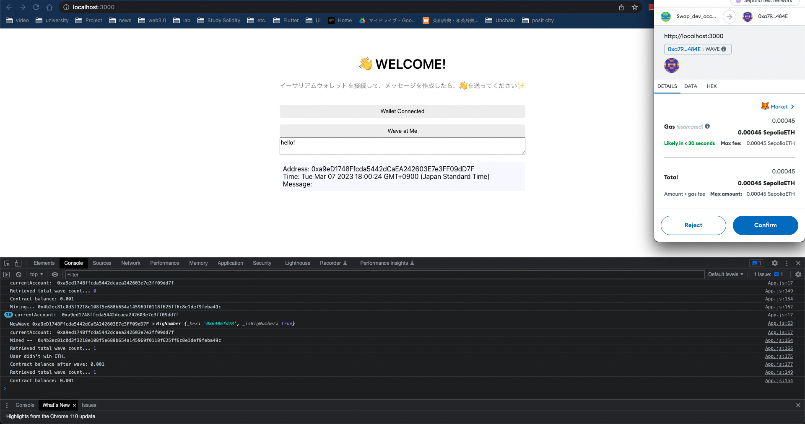
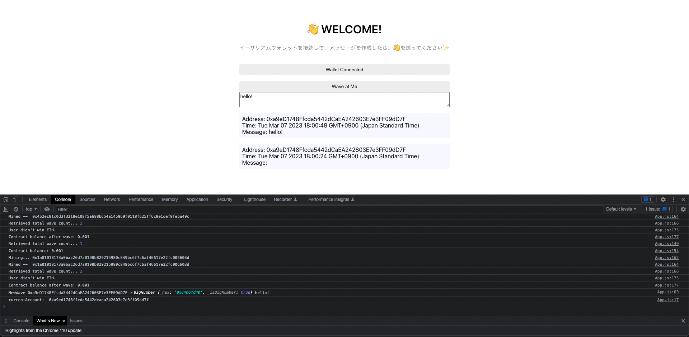

## 💬 ETH-dApp(prototype)

本レポジトリは ETH-dApp の完成版を示したものになります。

以下の手順を実行することで ETH-dApp の挙動を確認できます。

### レポジトリのクローン

[こちら](https://github.com/unchain-tech/ETH-dApp/tree/main)から ETH-dApp をクローンします。

### コントラクトとフロントの準備

1. Alchemy と MetaMask の設定

[こちら](https://app.unchain.tech/learn/ETH-dApp/ja/2/2/)のページを参考にして Alchemy と MetaMask の設定を行います。

2. キーの指定とテスト

packages/contract 下に.env ファイルを作成し、下のように Alchemy と MetaMask の key を指定。この際、Alchemy に関しては HTTP KEY をコピー&ペーストしてください。

```
PRIVATE_KEY = MetaMaskのPrivatekey
STAGING_ALCHEMY_KEY = AlchemyのHTTP-KEY
```

次に下のコマンドを実行することでコントラクトのテスト＋コンパイルができます。

```
yarn contract test
```

下のような結果が出ていれば成功です！

```
[
    '0xf39Fd6e51aad88F6F4ce6aB8827279cffFb92266',
    'This is wave #2',
    BigNumber { value: "1678176537" },
    waver: '0xf39Fd6e51aad88F6F4ce6aB8827279cffFb92266',
    message: 'This is wave #2',
    timestamp: BigNumber { value: "1678176537" }
  ]
]
✨  Done in 5.11s.
```

3. コントラクトのデプロイとフロントへの反映

`packages/contract`ディレクトリに移動し、以下のコマンドを実行しましょう。

```
yarn contract deploy
```

下記のような結果がでていれば成功です。

```
Deploying contracts with account:  0xa9eD1748Ffcda5442dCaEA242603E7e3FF09dD7F
Account balance:  25000000000000000
WavePortal address:  0xFD1035BFf7F4825c99c8cBC6fDAACDdca21DC3Ec
```

このうち`Contract deployed to:`に続く文字列を
`packages/client/src/App.js`の中の下の部分()に代入します。

次に deploy によって作成された`contractartifacts/contracts/WavePortal.sol/WavePortal.json`に格納されているコントラクトの情報を全てコピーします。

最後に`packages/client/src/utils/WavePortal.json`に先ほどコピーした内容を貼り付けます。

これでコントラクトとフロントエンドの準備は完了です！

### フロントエンドを起動

下のコマンドを実行させることでフロントエンドの動きを確認してみましょう。

```
yarn client start
```

下の画像のように`Wave at Me`ボタンを押すことでメッセージを送ることができるはずです！



